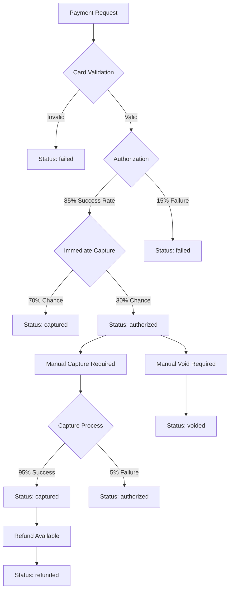

# Payment Flow Documentation

## Overview

This document describes the updated payment processing flow that implements proper authorization and capture logic with probabilistic behavior.

## Payment Status Flow

### Status Definitions

- **`pending`**: Initial status when payment is created
- **`authorized`**: Payment has been authorized but not yet captured (money held but not transferred)
- **`captured`**: Payment has been captured (money transferred to merchant)
- **`failed`**: Payment authorization failed
- **`voided`**: Authorized payment was voided (hold released)
- **`refunded`**: Captured payment was refunded

### Payment Processing Flow



## API Endpoints

### 1. Process Payment
```
POST /api/v1/payments/
```

**Request:**
```json
{
    "order_id": "order-uuid",
    "card_details": {
        "card_number": "4111111111111111",
        "expiry": "12/25",
        "cvv": "123"
    }
}
```

**Response (Success):**
```json
{
    "success": true,
    "data": {
        "payment_id": "payment-uuid",
        "order_id": "order-uuid",
        "amount": "100.00",
        "status": "authorized", // or "captured"
        "created_at": "2024-01-01T12:00:00Z"
    },
    "message": "Payment processed successfully"
}
```

### 2. Capture Payment
```
POST /api/v1/payments/capture/
```

**Request:**
```json
{
    "payment_id": "payment-uuid"
}
```

**Response (Success):**
```json
{
    "success": true,
    "data": {
        "status": "captured"
    },
    "message": "Payment captured successfully"
}
```

**Response (Error):**
```json
{
    "success": false,
    "exception": {
        "code": 1017,
        "message": "Invalid payment status",
        "description": "Only authorized payments can be captured"
    }
}
```

### 3. Void Payment
```
POST /api/v1/payments/void/
```

**Request:**
```json
{
    "payment_id": "payment-uuid"
}
```

**Response (Success):**
```json
{
    "success": true,
    "data": {
        "status": "voided"
    },
    "message": "Payment voided successfully"
}
```

### 4. Process Refund
```
POST /api/v1/refunds/
```

**Request:**
```json
{
    "payment_id": "payment-uuid"
}
```

**Response (Success):**
```json
{
    "success": true,
    "data": {
        "status": "refunded"
    },
    "message": "Refund processed successfully"
}
```

**Response (Error):**
```json
{
    "success": false,
    "exception": {
        "code": 1014,
        "message": "Refund failed",
        "description": "Refund processing failed"
    }
}
```

## Business Rules

### Authorization
- **Success Rate**: 85% of valid card details result in authorization
- **Card Validation**: Minimum 12 characters required for card number
- **Status**: Sets to `authorized` or `failed`

### Capture
- **Immediate Capture**: 70% of authorized payments are immediately captured
- **Manual Capture**: Remaining 30% require manual capture via API
- **Capture Success Rate**: 95% success rate for manual captures
- **Status Transition**: `authorized` → `captured`

### Void
- **Eligibility**: Only `authorized` payments can be voided
- **Purpose**: Release the authorization hold without transferring money
- **Status Transition**: `authorized` → `voided`

### Refund
- **Eligibility**: Only `captured` payments can be refunded
- **Success Rate**: 90% success rate for refunds
- **Status Transition**: `captured` → `refunded`
- **Business Rule**: Cannot refund authorized payments (use void instead)

## Error Codes

| Code | Message | Description |
|------|---------|-------------|
| 1016 | Unauthorized | User is not a merchant |
| 1017 | Invalid payment status | Only authorized payments can be captured/voided |
| 1018 | Capture/Void failed | Processing failed |
| 1014 | Refund failed | Only captured payments can be refunded |
| 1015 | Not found | Payment not found |

## Webhook Events

The system sends webhooks for all status changes:

- `payment.authorized` - Payment authorized but not captured
- `payment.captured` - Payment captured successfully
- `payment.failed` - Payment authorization failed
- `payment.voided` - Payment voided
- `payment.refunded` - Payment refunded

## Statistics Updates

The admin statistics now include separate counts for:

- `authorized_payments`: Payments in authorized status
- `captured_payments`: Payments in captured status
- `successful_payments`: Total of authorized + captured payments
- `successful_refunds`: Refunded payments
- `canceled_payments`: Failed payments

## Migration Notes

### Breaking Changes
1. **Refund Logic**: Authorized payments can no longer be refunded
2. **New Status**: Added `voided` status for released authorizations
3. **New Endpoints**: Added capture and void endpoints

### Backward Compatibility
- Existing API endpoints remain unchanged
- Payment processing endpoint behavior updated but maintains same interface
- Statistics API enhanced with additional fields

## Testing

The system includes comprehensive tests for:

- Payment authorization with probabilistic behavior
- Capture functionality for authorized payments
- Void functionality for authorized payments
- Refund functionality for captured payments only
- Error handling for invalid status transitions
- Webhook generation for all status changes

## Security Considerations

1. **Status Validation**: All status transitions are validated
2. **Merchant Authorization**: Only payment owners can perform operations
3. **Rate Limiting**: All endpoints have rate limiting applied
4. **Input Validation**: Card details and payment IDs are validated
5. **Audit Trail**: All operations are logged via webhooks

## Best Practices

1. **Capture Timing**: Capture payments as soon as goods/services are delivered
2. **Void vs Refund**: Use void for authorized payments, refund for captured payments
3. **Error Handling**: Always handle capture/void/refund failures gracefully
4. **Webhooks**: Implement webhook endpoints to receive real-time status updates
5. **Monitoring**: Monitor payment status distribution and failure rates
